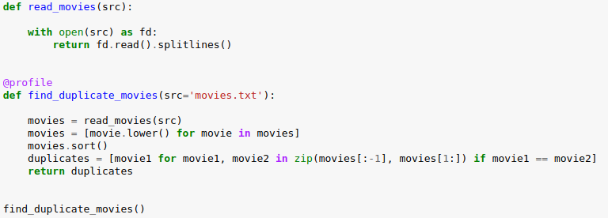
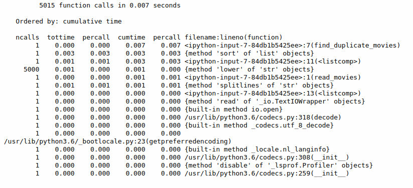

# A profiling decorator

1. Apply to a function with @profile
2. Profiles the function using cProfile, and prints out a report
3. Adapted from the Python 3.6 docs:
		https://docs.python.org/3/library/profile.html#profile.Profile

Code Example:

Output example:

